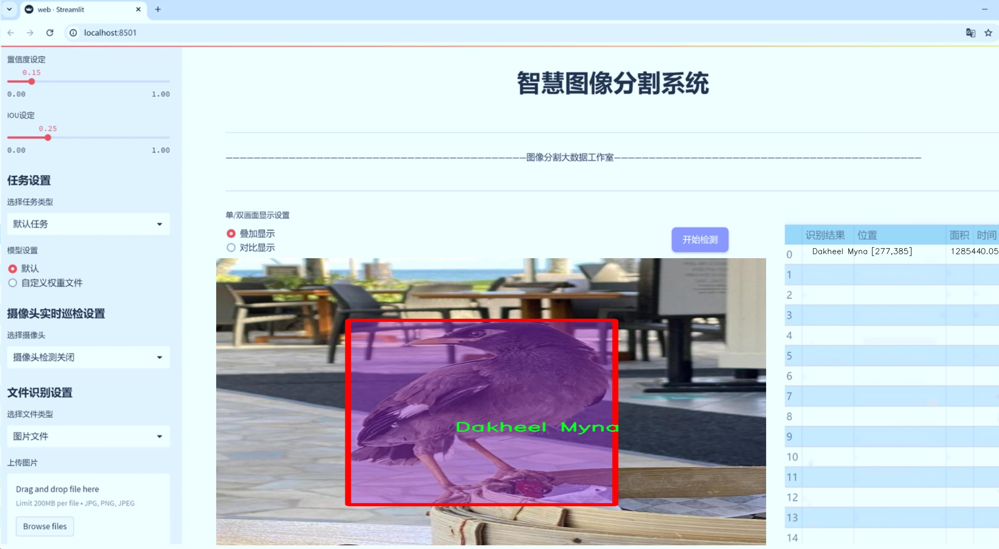
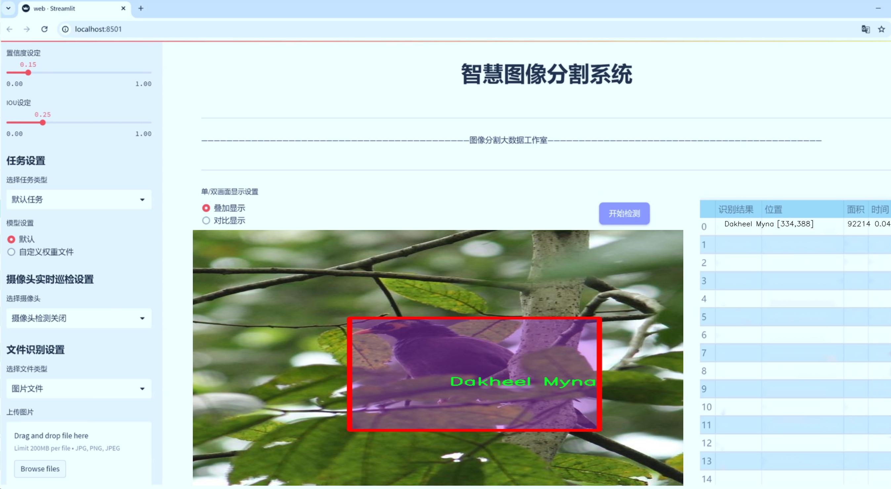
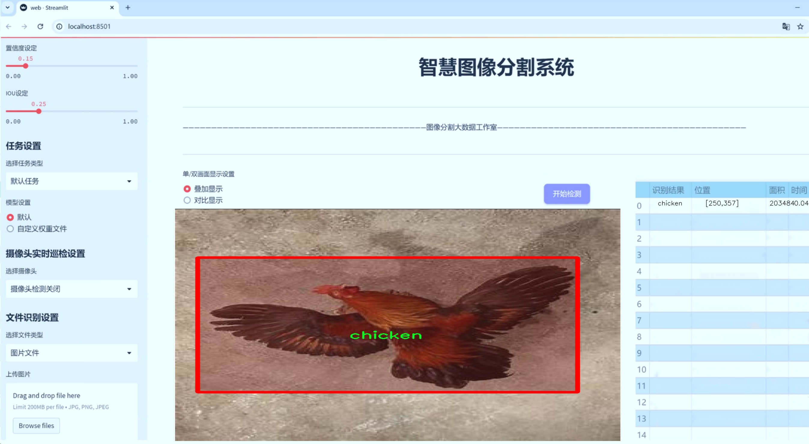
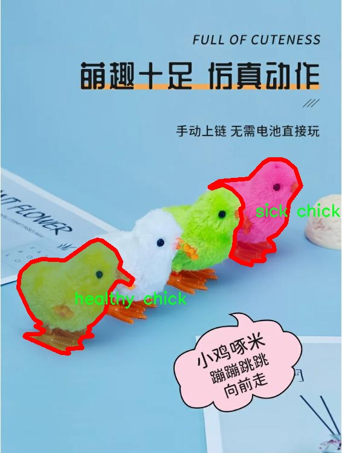
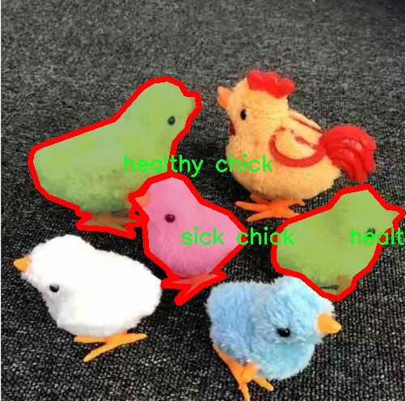
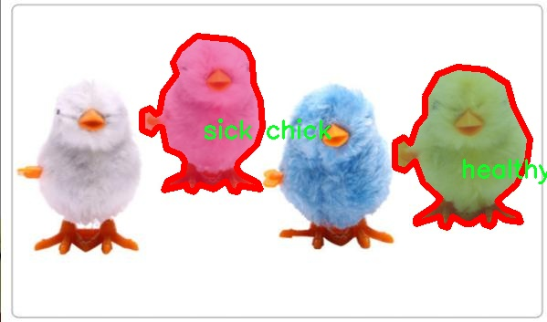
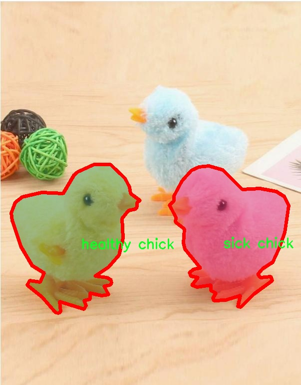

# 禽类健康状态分割系统源码＆数据集分享
 [yolov8-seg-fasternet＆yolov8-seg-C2f-DWR等50+全套改进创新点发刊_一键训练教程_Web前端展示]

### 1.研究背景与意义

项目参考[ILSVRC ImageNet Large Scale Visual Recognition Challenge](https://gitee.com/YOLOv8_YOLOv11_Segmentation_Studio/projects)

项目来源[AAAI Global Al lnnovation Contest](https://kdocs.cn/l/cszuIiCKVNis)

研究背景与意义

随着全球对禽类养殖业的重视，禽类健康管理已成为保障食品安全和提高养殖效益的重要环节。禽类健康状态的及时监测与评估不仅能够有效降低疾病传播的风险，还能提高养殖效率，降低经济损失。近年来，计算机视觉技术的迅猛发展为禽类健康状态的监测提供了新的解决方案，尤其是基于深度学习的目标检测与分割技术在此领域展现出了巨大的潜力。YOLO（You Only Look Once）系列模型以其高效的实时检测能力和较高的准确性，成为了目标检测领域的热门选择。YOLOv8作为该系列的最新版本，其在检测精度和速度上的进一步提升，为禽类健康状态的分割与识别提供了更为强大的技术支持。

本研究旨在基于改进的YOLOv8模型，构建一个针对禽类健康状态的分割系统。我们所使用的数据集包含3700张图像，涵盖了五个类别：Dakheel Myna、鸡、鹅、健康小鸡和病小鸡。这一数据集的多样性不仅能够反映不同禽类的健康状态，还能够为模型的训练提供丰富的样本，从而提高模型的泛化能力和准确性。通过对这些图像进行实例分割，我们可以更为精确地识别和区分健康与病态禽类，进而为养殖者提供科学的决策依据。

禽类健康状态的监测通常依赖于人工观察，这不仅耗时耗力，而且容易受到主观因素的影响。通过引入基于YOLOv8的自动化分割系统，我们可以实现对禽类健康状态的高效、准确监测。这一系统的应用不仅能够提高监测效率，还能减少人力成本，降低疾病传播的风险。尤其是在大规模养殖场中，自动化监测系统的引入将极大地提升禽类健康管理的科学性和有效性。

此外，研究成果的推广应用将为相关领域的研究提供重要的参考依据。通过对禽类健康状态的深入分析，我们能够更好地理解禽类疾病的发生机制，进而为疫病防控措施的制定提供数据支持。这不仅有助于提高禽类养殖的整体水平，也将为保障食品安全、维护公共健康做出积极贡献。

综上所述，基于改进YOLOv8的禽类健康状态分割系统的研究，不仅具有重要的理论意义，也具备广泛的应用前景。通过该系统的开发与应用，我们期望能够为禽类养殖业的健康管理提供新的技术手段，推动智能农业的发展，助力可持续养殖模式的实现。

### 2.图片演示







##### 注意：由于此博客编辑较早，上面“2.图片演示”和“3.视频演示”展示的系统图片或者视频可能为老版本，新版本在老版本的基础上升级如下：（实际效果以升级的新版本为准）

  （1）适配了YOLOV8的“目标检测”模型和“实例分割”模型，通过加载相应的权重（.pt）文件即可自适应加载模型。

  （2）支持“图片识别”、“视频识别”、“摄像头实时识别”三种识别模式。

  （3）支持“图片识别”、“视频识别”、“摄像头实时识别”三种识别结果保存导出，解决手动导出（容易卡顿出现爆内存）存在的问题，识别完自动保存结果并导出到tempDir中。

  （4）支持Web前端系统中的标题、背景图等自定义修改，后面提供修改教程。

  另外本项目提供训练的数据集和训练教程,暂不提供权重文件（best.pt）,需要您按照教程进行训练后实现图片演示和Web前端界面演示的效果。

### 3.视频演示

[3.1 视频演示](https://www.bilibili.com/video/BV1wM2rYkEYW/)

### 4.数据集信息展示

##### 4.1 本项目数据集详细数据（类别数＆类别名）

nc: 5
names: ['Dakheel Myna', 'chicken', 'goose', 'healthy chick', 'sick chick']


##### 4.2 本项目数据集信息介绍

数据集信息展示

在现代农业和动物健康管理中，禽类的健康状态监测显得尤为重要。为此，我们构建了一个专门用于训练改进YOLOv8-seg的禽类健康状态分割系统的数据集，命名为“robot_contest”。该数据集的设计旨在提高禽类健康状态的自动识别能力，进而为养殖业提供更为高效的管理方案。

“robot_contest”数据集包含五个主要类别，分别是：Dakheel Myna、鸡、鹅、健康小鸡和病小鸡。这些类别的选择不仅考虑了禽类的多样性，还特别关注了它们的健康状态，这对于禽类养殖的监测和管理至关重要。每个类别的样本均经过精心挑选和标注，以确保数据集的高质量和高代表性。

首先，Dakheel Myna作为一种特定的鸟类，其健康状态的监测能够为生态保护和生物多样性研究提供重要数据。该类别的样本包括不同年龄段和性别的个体，旨在捕捉该物种在不同环境下的健康表现。通过对Dakheel Myna的健康状态进行分析，我们能够更好地理解其生理特征和疾病预防措施。

其次，鸡作为全球最常见的家禽之一，其健康状况直接影响到养殖业的经济效益。因此，在数据集中，我们特别注重鸡的健康状态分割。健康小鸡和病小鸡的样本被详细标注，以便模型能够准确区分这两种状态。这一分类不仅有助于提高养殖效率，还能为疾病的早期预警提供数据支持。

鹅的健康状态同样是我们关注的重点。鹅在水禽养殖中占有重要地位，其健康状况的监测能够帮助养殖者及时发现潜在的健康问题，从而采取有效的防治措施。数据集中包含了多种不同环境下鹅的样本，确保模型在实际应用中具有良好的适应性。

健康小鸡和病小鸡的分类则是本数据集的另一大亮点。通过对这两类样本的深入分析，我们希望能够训练出一个高效的分割系统，能够在实际养殖环境中实时监测小鸡的健康状态。这不仅能够降低养殖成本，还能提高小鸡的存活率，促进养殖业的可持续发展。

总之，“robot_contest”数据集的构建不仅是为了训练改进YOLOv8-seg的禽类健康状态分割系统，更是为了推动禽类健康监测技术的发展。通过高质量的标注样本和多样化的类别设置，我们期望能够为养殖业提供更为精准的健康监测解决方案，最终实现禽类养殖的智能化和自动化管理。随着技术的不断进步和数据集的持续优化，我们相信该系统将在未来的禽类健康管理中发挥重要作用。










### 5.全套项目环境部署视频教程（零基础手把手教学）

[5.1 环境部署教程链接（零基础手把手教学）](https://www.bilibili.com/video/BV1jG4Ve4E9t/?vd_source=bc9aec86d164b67a7004b996143742dc)


[5.2 安装Python虚拟环境创建和依赖库安装视频教程链接（零基础手把手教学）](https://www.bilibili.com/video/BV1nA4VeYEze/?vd_source=bc9aec86d164b67a7004b996143742dc)

### 6.手把手YOLOV8-seg训练视频教程（零基础小白有手就能学会）

[6.1 手把手YOLOV8-seg训练视频教程（零基础小白有手就能学会）](https://www.bilibili.com/video/BV1cA4VeYETe/?vd_source=bc9aec86d164b67a7004b996143742dc)


按照上面的训练视频教程链接加载项目提供的数据集，运行train.py即可开始训练



     Epoch   gpu_mem       box       obj       cls    labels  img_size
     1/200     0G   0.01576   0.01955  0.007536        22      1280: 100%|██████████| 849/849 [14:42<00:00,  1.04s/it]
               Class     Images     Labels          P          R     mAP@.5 mAP@.5:.95: 100%|██████████| 213/213 [01:14<00:00,  2.87it/s]
                 all       3395      17314      0.994      0.957      0.0957      0.0843

     Epoch   gpu_mem       box       obj       cls    labels  img_size
     2/200     0G   0.01578   0.01923  0.007006        22      1280: 100%|██████████| 849/849 [14:44<00:00,  1.04s/it]
               Class     Images     Labels          P          R     mAP@.5 mAP@.5:.95: 100%|██████████| 213/213 [01:12<00:00,  2.95it/s]
                 all       3395      17314      0.996      0.956      0.0957      0.0845

     Epoch   gpu_mem       box       obj       cls    labels  img_size
     3/200     0G   0.01561    0.0191  0.006895        27      1280: 100%|██████████| 849/849 [10:56<00:00,  1.29it/s]
               Class     Images     Labels          P          R     mAP@.5 mAP@.5:.95: 100%|███████   | 187/213 [00:52<00:00,  4.04it/s]
                 all       3395      17314      0.996      0.957      0.0957      0.0845


### 7.50+种全套YOLOV8-seg创新点代码加载调参视频教程（一键加载写好的改进模型的配置文件）

[7.1 50+种全套YOLOV8-seg创新点代码加载调参视频教程（一键加载写好的改进模型的配置文件）](https://www.bilibili.com/video/BV1Hw4VePEXv/?vd_source=bc9aec86d164b67a7004b996143742dc)

### 8.YOLOV8-seg图像分割算法原理

原始YOLOV8-seg算法原理

YOLO（You Only Look Once）系列算法自其首次提出以来，便在目标检测领域中引起了广泛关注，尤其是YOLOv8作为该系列的最新版本，其在检测精度和速度上均有显著提升。YOLOv8-seg算法不仅延续了YOLO系列的优良传统，还引入了分割功能，使其在处理复杂场景时更具优势。该算法的设计理念基于深度学习和计算机视觉的最新进展，旨在实现高效的目标检测与分割。

YOLOv8-seg的网络结构主要由四个模块组成：输入端、主干网络、Neck端和输出端。输入端负责对输入图像进行预处理，包括Mosaic数据增强、自适应图像缩放和灰度填充等。这些预处理步骤旨在提高模型对多样化背景和复杂环境的适应能力，确保输入数据的质量和多样性，从而为后续的特征提取打下良好的基础。

在主干网络中，YOLOv8-seg采用了先进的卷积神经网络结构，通过Conv、C2f和SPPF等模块提取图像特征。C2f模块的引入，使得网络在特征提取过程中能够更好地保留细粒度的上下文信息，从而增强了对目标的感知能力。SPPF模块则通过不同内核尺寸的池化操作，进一步整合特征图的信息，确保网络能够有效捕捉到多尺度的目标特征。

Neck端的设计基于路径聚合网络（PAN）结构，通过上采样、下采样和特征拼接等操作，促进了不同尺度特征图的融合。这一过程不仅提高了网络对小目标的检测能力，还增强了模型对复杂背景的适应性。Neck端的双塔结构设计，使得语义特征与定位特征能够更有效地传递，进一步提升了网络的整体性能。

输出端则采用了解耦头结构，实现了分类和回归过程的分离。这一设计的优势在于能够加速模型的收敛，同时提高了分类和回归的精度。YOLOv8-seg在损失计算方面，采用了BCE（Binary Cross-Entropy）计算分类损失，并结合DFL（Distribution Focal Loss）和CIoU（Complete Intersection over Union）损失函数进行回归损失的计算。这种损失函数的选择，旨在提升模型的泛化能力和精准度，使其在复杂环境下仍能保持良好的检测性能。

尽管YOLOv8-seg在多个方面进行了优化，但在复杂水面环境下，仍然面临小目标漂浮物特征复杂、背景多样等挑战。这些因素导致了模型在定位和目标感知能力上的不足。因此，针对这些问题，研究者们提出了YOLOv8-WSSOD算法进行改进。该算法首先引入了捕获远程依赖的思想，通过BiFormer双层路由注意力机制构建C2fBF模块，旨在减轻主干网络下采样过程中的噪声影响，从而保留更多细粒度的上下文信息。

此外，为了进一步提升网络对小目标的感知能力，YOLOv8-WSSOD在Neck端引入了GSConv和Slim-neck技术。这些技术的应用不仅保持了模型的精度，还有效降低了计算量，使得YOLOv8-WSSOD在复杂环境下的检测性能得到了显著提升。最后，使用MPDIoU损失函数替换CIoU损失函数，进一步提高了模型的泛化能力和精准度。

综上所述，YOLOv8-seg算法通过其独特的网络结构和优化策略，在目标检测与分割领域展现出了强大的能力。尽管在特定复杂环境下仍存在一定的挑战，但通过不断的改进和优化，YOLOv8系列算法无疑将在未来的研究和应用中发挥更大的作用。


### 9.系统功能展示（检测对象为举例，实际内容以本项目数据集为准）

图9.1.系统支持检测结果表格显示

  图9.2.系统支持置信度和IOU阈值手动调节

  图9.3.系统支持自定义加载权重文件best.pt(需要你通过步骤5中训练获得)

  图9.4.系统支持摄像头实时识别

  图9.5.系统支持图片识别

  图9.6.系统支持视频识别

  图9.7.系统支持识别结果文件自动保存

  图9.8.系统支持Excel导出检测结果数据


### 10.50+种全套YOLOV8-seg创新点原理讲解（非科班也可以轻松写刊发刊，V11版本正在科研待更新）

#### 10.1 由于篇幅限制，每个创新点的具体原理讲解就不一一展开，具体见下列网址中的创新点对应子项目的技术原理博客网址【Blog】：


[10.1 50+种全套YOLOV8-seg创新点原理讲解链接](https://gitee.com/qunmasj/good)

#### 10.2 部分改进模块原理讲解(完整的改进原理见上图和技术博客链接)【如果此小节的图加载失败可以通过CSDN或者Github搜索该博客的标题访问原始博客，原始博客图片显示正常】
### 可变性卷积DCN简介
卷积神经网络由于其构建模块中固定的几何结构，本质上受限于模型几何变换。为了提高卷积神经网络的转换建模能力，《Deformable Convolutional Networks》作者提出了两个模块：可变形卷积（deformable convolution）和可变形RoI池（deformable RoI pooling）。这两个模块均基于用额外的偏移来增加模块中的空间采样位置以及从目标任务中学习偏移的思想，而不需要额外的监督。

第一次证明了在深度神经网络中学习密集空间变换（dense spatial transformation）对于复杂的视觉任务是有效的

视觉识别中的一个关键挑战是如何适应对象比例、姿态、视点和零件变形中的几何变化或模型几何变换。一般有两种方法实现：
1）建立具有足够期望变化的训练数据集。这通常通过增加现有的数据样本来实现，例如通过仿射变换。但是训练成本昂贵而且模型参数庞大。
2）使用变换不变（transformation-invariant）的特征和算法。比如比较有名的SIFT(尺度不变特征变换)便是这一类的代表算法。

但以上的方法有两个缺点：
1）几何变换被假定为固定的和已知的，这些先验知识被用来扩充数据，设计特征和算法。为此，这个假设阻止了对具有未知几何变换的新任务的推广，从而导致这些几何变换可能没有被正确建模。
2）对于不变特征和算法进行手动设计，对于过于复杂的变换可能是困难的或不可行的。

卷积神经网络本质上局限于模拟大型未知转换。局限性源于CNN模块的固定几何结构：卷积单元在固定位置对输入特征图进行采样；池化层以固定比率降低特征矩阵分辨率；RoI（感兴趣区域）池化层将RoI分成固定的空间箱（spatial bins）等。缺乏处理几何变换的内部机制。

这种内部机制的缺乏会导致一些问题，举个例子。同一个CNN层中所有激活单元的感受野大小是相同的，但是这是不可取的。因为不同的位置可能对应于具有不同尺度或变形的对象，所以尺度或感受野大小的自适应确定对于具有精细定位的视觉识别是渴望的。

对于这些问题，作者提出了两个模块提高CNNs对几何变换建模的能力。


deformable convolution（可变形卷积）
将2D偏移量添加到标准卷积中的常规网格采样位置，使得采样网格能够自由变形。通过额外的卷积层，从前面的特征映射中学习偏移。因此，变形采用局部、密集和自适应的方式取决于输入特征。


deformable RoI pooling（可变形RoI池化）
为先前RoI池化的常规库（bin）分区中的每个库位置（bin partition）增加了一个偏移量。类似地，偏移是从前面的特征图和感兴趣区域中学习的，从而能够对具有不同形状的对象进行自适应部件定位（adaptive part localization）。

#### Deformable Convolutional Networks
Deformable Convolution
2D卷积由两个步骤组成：
1）在输入特征图x xx上使用规则网格R RR进行采样。
2）把这些采样点乘不同权重w ww后相加。

网格R定义感受野大小和扩张程度，比如内核大小为3x3，扩张程度为1的网格R可以表示为：
R = { ( − 1 , − 1 ) , ( − 1 , 0 ) , … , ( 0 , 1 ) , ( 1 , 1 ) } R = \{(-1,-1),(-1,0),\dots,(0,1),(1,1)\}
R={(−1,−1),(−1,0),…,(0,1),(1,1)}

​
 一般为小数，使用双线性插值进行处理。（把小数坐标分解到相邻的四个整数坐标点来计算结果）


具体操作如图所示：


首先对输入特征层进行一个普通的3x3卷积处理得到偏移域（offset field）。偏移域特征图具有与输入特征图相同的空间分辨率，channels维度2N对应于N个2D（xy两个方向）偏移。其中的N是原输入特征图上所具有的N个channels，也就是输入输出channels保持不变，这里xy两个channels分别对输出特征图上的一个channels进行偏移。确定采样点后就通过与相对应的权重w点乘相加得到输出特征图上该点最终值。

前面也提到过，由于这里xy两个方向所训练出来的偏移量一般来说是一个小数，那么为了得到这个点所对应的数值，会采用双线性插值的方法，从最近的四个邻近坐标点中计算得到该偏移点的数值，公式如下：


具体推理过程见：双线性插值原理

#### Deformable RoI Poolingb
所有基于区域提议（RPN）的对象检测方法都使用RoI池话处理，将任意大小的输入矩形区域转换为固定大小的特征图。


 一般为小数，需要使用双线性插值进行处理。


具体操作如图所示：


当时看这个部分的时候觉得有些突兀，明明RoI池化会将特征层转化为固定尺寸的区域。其实，我个人觉得，这个部分与上述的可变性卷积操作是类似的。这里同样是使用了一个普通的RoI池化操作，进行一些列处理后得到了一个偏移域特征图，然后重新作用于原来的w × H w \times Hw×H的RoI。只不过这里不再是规律的逐行逐列对每个格子进行池化，而是对于格子进行偏移后再池化处理。

#### Postion﹣Sensitive RoI Pooling
除此之外，论文还提出一种PS RoI池化（Postion﹣Sensitive RoI Pooling）。不同于上述可变形RoI池化中的全连接过程，这里使用全卷积替换。

具体操作如图所示：


首先，对于原来的特征图来说，原本是将输入特征图上的RoI区域分成k × k k\times kk×k个bin。而在这里，则是将输入特征图进行卷积操作，分别得到一个channels为k 2 ( C + 1 ) k^{2}(C+1)k (C+1)的得分图（score maps）和一个channels为2 k 2 ( C + 1 ) 2k{2}(C+1)2k 2 (C+1)的偏移域（offset fields），这两个特征矩阵的宽高是与输入特征矩阵相同的。其中，得分图的channels中，k × k k \times kk×k分别表示的是每一个网格，C CC表示的检测对象的类别数目，1表示背景。而在偏移域中的2表示xy两个方向的偏移。
也就是说，在PS RoI池化中，对于RoI的每一个网格都独自占一个通道形成一层得分图，然后其对于的偏移量占两个通道。offset fields得到的偏移是归一化后的偏移，需要通过和deformable RoI pooling中一样的变换方式得到∆ p i j ∆p_{ij}∆p ij，然后对每层得分图进行偏移池化处理。最后处理完的结果就对应着最后输出的一个网格。所以其包含了位置信息。

原文论述为：


#### Understanding Deformable ConvNets
当可变形卷积叠加时，复合变形的效果是深远的。如图所示：


ps：a是标准卷积的固定感受野，b是可变形卷积的适应性感受野。

感受野和标准卷积中的采样位置在整个顶部特征图上是固定的(左)。在可变形卷积中，它们根据对象的比例和形状进行自适应调整(右)。


### 11.项目核心源码讲解（再也不用担心看不懂代码逻辑）

#### 11.1 ui.py

以下是对代码的核心部分进行保留和详细注释的版本：

```python
import sys
import subprocess

def run_script(script_path):
    """
    使用当前 Python 环境运行指定的脚本。

    Args:
        script_path (str): 要运行的脚本路径

    Returns:
        None
    """
    # 获取当前 Python 解释器的路径
    python_path = sys.executable

    # 构建运行命令，使用 streamlit 运行指定的脚本
    command = f'"{python_path}" -m streamlit run "{script_path}"'

    # 执行命令并等待其完成
    result = subprocess.run(command, shell=True)
    
    # 检查命令执行结果，如果返回码不为0，表示执行出错
    if result.returncode != 0:
        print("脚本运行出错。")

# 主程序入口
if __name__ == "__main__":
    # 指定要运行的脚本路径
    script_path = "web.py"  # 假设脚本在当前目录下

    # 调用函数运行指定的脚本
    run_script(script_path)
```

### 代码分析和注释：

1. **导入模块**：
   - `sys`：用于访问与 Python 解释器紧密相关的变量和函数。
   - `subprocess`：用于创建新进程、连接到它们的输入/输出/错误管道，并获得它们的返回码。

2. **`run_script` 函数**：
   - 该函数接收一个脚本路径作为参数，并使用当前 Python 环境运行该脚本。
   - `python_path = sys.executable`：获取当前 Python 解释器的完整路径。
   - `command`：构建一个命令字符串，用于在 shell 中运行 `streamlit` 命令。
   - `subprocess.run(command, shell=True)`：执行构建的命令，并等待其完成。
   - `result.returncode`：检查命令的返回码，如果不为0，表示脚本运行出错。

3. **主程序入口**：
   - `if __name__ == "__main__":`：确保该代码块仅在直接运行该脚本时执行，而不是作为模块导入时执行。
   - `script_path = "web.py"`：指定要运行的脚本文件名。
   - `run_script(script_path)`：调用函数，执行指定的脚本。

通过这些注释，代码的功能和结构得到了清晰的解释。

这个程序文件 `ui.py` 是一个用于运行指定 Python 脚本的简单工具，主要通过 `subprocess` 模块来实现。程序的第一部分导入了必要的模块，包括 `sys`、`os` 和 `subprocess`，以及一个自定义的路径处理函数 `abs_path`，这个函数可能用于获取脚本的绝对路径。

在 `run_script` 函数中，程序接受一个参数 `script_path`，这是要运行的 Python 脚本的路径。函数首先获取当前 Python 解释器的路径，接着构建一个命令字符串，这个命令使用 `streamlit` 来运行指定的脚本。`streamlit` 是一个用于构建数据应用的框架，通常用于快速创建和分享数据应用。

然后，程序使用 `subprocess.run` 方法来执行这个命令。`shell=True` 参数表示命令将在一个新的 shell 中执行。执行完命令后，程序检查返回码，如果返回码不为零，说明脚本运行出错，程序会打印出错误信息。

在文件的最后部分，程序通过 `if __name__ == "__main__":` 语句来判断是否直接运行该脚本。如果是，程序会调用 `abs_path` 函数来获取 `web.py` 脚本的绝对路径，并将其传递给 `run_script` 函数，从而启动这个脚本。

总体来看，这个程序的功能是提供一个简单的接口来运行一个名为 `web.py` 的 Python 脚本，并且能够处理运行过程中的错误。

#### 11.2 ultralytics\nn\backbone\revcol.py

以下是经过简化和注释的核心代码部分，保留了主要功能和逻辑。

```python
import torch
import torch.nn as nn

# 定义一个自定义的反向传播函数
class ReverseFunction(torch.autograd.Function):
    @staticmethod
    def forward(ctx, run_functions, alpha, *args):
        # 保存运行的函数和alpha参数
        ctx.run_functions = run_functions
        ctx.alpha = alpha
        
        # 从输入参数中提取数据
        x, c0, c1, c2, c3 = args
        
        # 逐层计算并保存中间结果
        c0 = run_functions[0](x, c1) + c0 * alpha[0]
        c1 = run_functions[1](c0, c2) + c1 * alpha[1]
        c2 = run_functions[2](c1, c3) + c2 * alpha[2]
        c3 = run_functions[3](c2, None) + c3 * alpha[3]
        
        # 保存计算过程中需要反向传播的张量
        ctx.save_for_backward(x, c0, c1, c2, c3)
        return x, c0, c1, c2, c3

    @staticmethod
    def backward(ctx, *grad_outputs):
        # 获取保存的张量和参数
        x, c0, c1, c2, c3 = ctx.saved_tensors
        run_functions = ctx.run_functions
        alpha = ctx.alpha
        
        # 计算每一层的梯度
        g3_up = grad_outputs[4]
        g3_left = g3_up * alpha[3]
        oup3 = run_functions[3](c2, None)
        torch.autograd.backward(oup3, g3_up, retain_graph=True)
        
        # 继续计算其他层的梯度
        g2_up = grad_outputs[3] + c2.grad
        g2_left = g2_up * alpha[2]
        oup2 = run_functions[2](c1, c3)
        torch.autograd.backward(oup2, g2_up, retain_graph=True)
        
        g1_up = grad_outputs[2] + c1.grad
        g1_left = g1_up * alpha[1]
        oup1 = run_functions[1](c0, c2)
        torch.autograd.backward(oup1, g1_up, retain_graph=True)
        
        g0_up = grad_outputs[1] + c0.grad
        g0_left = g0_up * alpha[0]
        oup0 = run_functions[0](x, c1)
        torch.autograd.backward(oup0, g0_up)
        
        # 返回每一层的梯度
        return None, None, g0_left, g1_left, g2_left, g3_left

# 定义网络结构的基础模块
class SubNet(nn.Module):
    def __init__(self, channels, layers, kernel, first_col, save_memory) -> None:
        super().__init__()
        self.save_memory = save_memory
        # 初始化alpha参数
        self.alpha0 = nn.Parameter(torch.ones((1, channels[0], 1, 1)), requires_grad=True)
        self.alpha1 = nn.Parameter(torch.ones((1, channels[1], 1, 1)), requires_grad=True)
        self.alpha2 = nn.Parameter(torch.ones((1, channels[2], 1, 1)), requires_grad=True)
        self.alpha3 = nn.Parameter(torch.ones((1, channels[3], 1, 1)), requires_grad=True)

        # 创建网络的各个层
        self.level0 = Level(0, channels, layers, kernel, first_col)
        self.level1 = Level(1, channels, layers, kernel, first_col)
        self.level2 = Level(2, channels, layers, kernel, first_col)
        self.level3 = Level(3, channels, layers, kernel, first_col)

    def forward(self, *args):
        # 根据内存保存策略选择前向传播方式
        if self.save_memory:
            return self._forward_reverse(*args)
        else:
            return self._forward_nonreverse(*args)

    def _forward_nonreverse(self, *args):
        # 非反向传播的前向计算
        x, c0, c1, c2, c3 = args
        c0 = self.alpha0 * c0 + self.level0(x, c1)
        c1 = self.alpha1 * c1 + self.level1(c0, c2)
        c2 = self.alpha2 * c2 + self.level2(c1, c3)
        c3 = self.alpha3 * c3 + self.level3(c2, None)
        return c0, c1, c2, c3

    def _forward_reverse(self, *args):
        # 反向传播的前向计算
        local_funs = [self.level0, self.level1, self.level2, self.level3]
        alpha = [self.alpha0, self.alpha1, self.alpha2, self.alpha3]
        return ReverseFunction.apply(local_funs, alpha, *args)

# 定义整个网络结构
class RevCol(nn.Module):
    def __init__(self, kernel='C2f', channels=[32, 64, 96, 128], layers=[2, 3, 6, 3], num_subnet=5, save_memory=True) -> None:
        super().__init__()
        self.num_subnet = num_subnet
        self.channels = channels
        self.layers = layers
        self.stem = Conv(3, channels[0], k=4, s=4, p=0)

        # 创建多个子网络
        for i in range(num_subnet):
            first_col = (i == 0)
            self.add_module(f'subnet{i}', SubNet(channels, layers, kernel, first_col, save_memory))

    def forward(self, x):
        # 前向传播
        c0, c1, c2, c3 = 0, 0, 0, 0
        x = self.stem(x)
        for i in range(self.num_subnet):
            c0, c1, c2, c3 = getattr(self, f'subnet{i}')(x, c0, c1, c2, c3)
        return [c0, c1, c2, c3]
```

### 代码说明
1. **ReverseFunction**: 这是一个自定义的反向传播函数，负责在前向传播时保存中间结果，并在反向传播时计算梯度。
2. **SubNet**: 这个类表示一个子网络，包含多个层和参数。根据内存策略选择不同的前向传播方式。
3. **RevCol**: 这是整个网络的主类，负责初始化和前向传播。它包含多个子网络，并通过stem层处理输入数据。

### 关键点
- 使用`torch.autograd.Function`实现自定义的前向和反向传播。
- 在`SubNet`中使用参数`alpha`来控制每一层的输出。
- `RevCol`类将多个子网络组合在一起，形成完整的网络结构。

这个程序文件`revcol.py`主要实现了一个名为`RevCol`的神经网络模块，包含了多个子模块和自定义的反向传播机制。以下是对代码的详细讲解。

首先，文件导入了必要的PyTorch库和一些自定义模块。`Conv`、`C2f`、`C3`和`C3Ghost`等模块可能是实现卷积操作和其他网络结构的基础组件。

接下来，定义了一些辅助函数：
- `get_gpu_states`：获取指定GPU设备的随机数生成状态。
- `get_gpu_device`：从输入的张量中提取出使用的GPU设备。
- `set_device_states`：设置CPU和GPU的随机数生成状态。
- `detach_and_grad`：对输入的张量进行分离并设置其需要梯度的标志。
- `get_cpu_and_gpu_states`：获取CPU和GPU的随机数生成状态。

`ReverseFunction`类是一个自定义的反向传播函数，继承自`torch.autograd.Function`。它的`forward`方法实现了前向传播逻辑，使用了多个层（`l0`、`l1`、`l2`、`l3`）和对应的缩放因子（`alpha`）。在计算过程中，它会保存当前的随机数状态，以便在反向传播时恢复。`backward`方法则实现了反向传播的逻辑，计算梯度并进行相应的状态恢复和特征反转。

`Fusion`类用于实现不同层之间的融合操作。根据层级和是否为第一列，选择不同的下采样或上采样策略。

`Level`类表示网络中的一个层级，包含了融合操作和多个卷积块。它的`forward`方法首先进行融合，然后通过卷积块处理输入。

`SubNet`类表示一个子网络，包含多个层级和对应的缩放因子。它有两个前向传播方法：`_forward_nonreverse`和`_forward_reverse`，分别用于常规和反向传播模式。`forward`方法根据是否需要节省内存来选择使用哪种前向传播方式，并对缩放因子进行约束。

最后，`RevCol`类是整个网络的核心模块。它初始化了多个子网络，并定义了一个前向传播方法。在前向传播中，输入首先经过一个卷积层，然后依次通过所有子网络进行处理，最终返回各个层级的输出。

整体来看，这个文件实现了一个复杂的神经网络结构，利用了自定义的反向传播机制和层级融合策略，以提高模型的表达能力和训练效率。

#### 11.3 ultralytics\models\rtdetr\predict.py

以下是代码中最核心的部分，并附上详细的中文注释：

```python
import torch
from ultralytics.data.augment import LetterBox
from ultralytics.engine.predictor import BasePredictor
from ultralytics.engine.results import Results
from ultralytics.utils import ops

class RTDETRPredictor(BasePredictor):
    """
    RT-DETR (Real-Time Detection Transformer) 预测器，扩展自 BasePredictor 类，用于使用百度的 RT-DETR 模型进行预测。

    该类利用视觉变换器的强大功能提供实时目标检测，同时保持高精度。它支持高效的混合编码和 IoU 感知查询选择等关键特性。
    """

    def postprocess(self, preds, img, orig_imgs):
        """
        对模型的原始预测结果进行后处理，以生成边界框和置信度分数。

        该方法根据置信度和类（如果在 `self.args` 中指定）过滤检测结果。

        参数:
            preds (torch.Tensor): 模型的原始预测结果。
            img (torch.Tensor): 处理后的输入图像。
            orig_imgs (list or torch.Tensor): 原始未处理的图像。

        返回:
            (list[Results]): 包含后处理边界框、置信度分数和类别标签的 Results 对象列表。
        """
        # 获取预测结果的维度
        nd = preds[0].shape[-1]
        # 将预测结果分割为边界框和分数
        bboxes, scores = preds[0].split((4, nd - 4), dim=-1)

        # 如果输入图像不是列表，则将其转换为 numpy 格式
        if not isinstance(orig_imgs, list):
            orig_imgs = ops.convert_torch2numpy_batch(orig_imgs)

        results = []
        for i, bbox in enumerate(bboxes):  # 遍历每个边界框
            # 将边界框从中心点宽高格式转换为左上角和右下角格式
            bbox = ops.xywh2xyxy(bbox)
            # 获取每个边界框的最大分数和对应的类别
            score, cls = scores[i].max(-1, keepdim=True)
            # 根据置信度过滤边界框
            idx = score.squeeze(-1) > self.args.conf
            # 如果指定了类别，则进一步过滤
            if self.args.classes is not None:
                idx = (cls == torch.tensor(self.args.classes, device=cls.device)).any(1) & idx
            # 合并边界框、分数和类别，并根据索引进行过滤
            pred = torch.cat([bbox, score, cls], dim=-1)[idx]
            orig_img = orig_imgs[i]
            oh, ow = orig_img.shape[:2]  # 获取原始图像的高度和宽度
            # 将预测的边界框坐标转换为原始图像的尺度
            pred[..., [0, 2]] *= ow
            pred[..., [1, 3]] *= oh
            img_path = self.batch[0][i]  # 获取图像路径
            # 将结果添加到列表中
            results.append(Results(orig_img, path=img_path, names=self.model.names, boxes=pred))
        return results

    def pre_transform(self, im):
        """
        在将输入图像送入模型进行推理之前，对其进行预处理。输入图像被调整为方形比例并填充。

        参数:
            im (list[np.ndarray] | torch.Tensor): 输入图像，形状为 (N,3,h,w) 的张量，或 [(h,w,3) x N] 的列表。

        返回:
            (list): 预处理后的图像列表，准备进行模型推理。
        """
        # 创建 LetterBox 对象以进行图像预处理
        letterbox = LetterBox(self.imgsz, auto=False, scaleFill=True)
        # 对每个图像进行预处理
        return [letterbox(image=x) for x in im]
```

### 代码核心部分说明：
1. **postprocess 方法**：负责对模型的原始预测结果进行后处理，生成边界框和置信度分数，并根据置信度和类别进行过滤，最终返回处理后的结果列表。
2. **pre_transform 方法**：在推理之前对输入图像进行预处理，确保图像的形状为方形并进行适当的缩放，以便模型能够正确处理。

这个程序文件 `ultralytics\models\rtdetr\predict.py` 定义了一个名为 `RTDETRPredictor` 的类，主要用于基于百度的 RT-DETR 模型进行实时目标检测。该类继承自 `BasePredictor`，利用视觉变换器的强大能力，在保持高精度的同时实现实时物体检测。文件中包含了对输入图像的预处理、模型预测结果的后处理等功能。

在类的文档字符串中，提供了关于该类的基本信息，包括其功能、示例用法以及主要属性的说明。`imgsz` 属性指定了推理时图像的大小，要求为正方形并且填充比例正确；`args` 属性则用于存储传递给预测器的参数。

`postprocess` 方法负责对模型的原始预测结果进行后处理，生成边界框和置信度分数。该方法首先将模型的输出分割为边界框和分数，然后根据置信度和指定的类别进行过滤。处理后的结果以 `Results` 对象的形式返回，包含了原始图像、路径、类别名称和过滤后的边界框信息。

`pre_transform` 方法用于在将输入图像送入模型进行推理之前进行预处理。该方法使用 `LetterBox` 类将输入图像调整为正方形，并确保填充比例正确。返回的结果是一个经过预处理的图像列表，准备好供模型进行推理。

总体来说，这个文件实现了一个高效的目标检测预测器，能够处理输入图像并生成相应的检测结果，适用于实时应用场景。

#### 11.4 ultralytics\models\yolo\pose\predict.py

以下是经过简化和注释的核心代码部分：

```python
# 导入必要的模块和类
from ultralytics.engine.results import Results
from ultralytics.models.yolo.detect.predict import DetectionPredictor
from ultralytics.utils import DEFAULT_CFG, LOGGER, ops

class PosePredictor(DetectionPredictor):
    """
    PosePredictor类，继承自DetectionPredictor类，用于基于姿态模型的预测。
    """

    def __init__(self, cfg=DEFAULT_CFG, overrides=None, _callbacks=None):
        """初始化PosePredictor，设置任务为'pose'并记录使用'mps'作为设备的警告。"""
        super().__init__(cfg, overrides, _callbacks)  # 调用父类构造函数
        self.args.task = 'pose'  # 设置任务为姿态检测
        # 检查设备是否为Apple MPS，并记录警告
        if isinstance(self.args.device, str) and self.args.device.lower() == 'mps':
            LOGGER.warning("WARNING ⚠️ Apple MPS known Pose bug. Recommend 'device=cpu' for Pose models. "
                           'See https://github.com/ultralytics/ultralytics/issues/4031.')

    def postprocess(self, preds, img, orig_imgs):
        """对给定输入图像或图像列表返回检测结果。"""
        # 应用非极大值抑制，过滤掉低置信度的预测框
        preds = ops.non_max_suppression(preds,
                                        self.args.conf,  # 置信度阈值
                                        self.args.iou,   # IOU阈值
                                        agnostic=self.args.agnostic_nms,  # 是否类别无关的NMS
                                        max_det=self.args.max_det,  # 最大检测框数量
                                        classes=self.args.classes,  # 需要检测的类别
                                        nc=len(self.model.names))  # 类别数量

        # 如果输入图像不是列表，则将其转换为numpy数组
        if not isinstance(orig_imgs, list):
            orig_imgs = ops.convert_torch2numpy_batch(orig_imgs)

        results = []  # 存储结果的列表
        for i, pred in enumerate(preds):  # 遍历每个预测结果
            orig_img = orig_imgs[i]  # 获取原始图像
            # 将预测框的坐标缩放到原始图像的尺寸
            pred[:, :4] = ops.scale_boxes(img.shape[2:], pred[:, :4], orig_img.shape).round()
            # 获取关键点预测
            pred_kpts = pred[:, 6:].view(len(pred), *self.model.kpt_shape) if len(pred) else pred[:, 6:]
            # 缩放关键点坐标到原始图像的尺寸
            pred_kpts = ops.scale_coords(img.shape[2:], pred_kpts, orig_img.shape)
            img_path = self.batch[0][i]  # 获取图像路径
            # 将结果存储到Results对象中
            results.append(
                Results(orig_img, path=img_path, names=self.model.names, boxes=pred[:, :6], keypoints=pred_kpts))
        return results  # 返回所有结果
```

### 代码说明：
1. **PosePredictor类**：该类继承自`DetectionPredictor`，用于姿态检测任务。
2. **构造函数`__init__`**：初始化PosePredictor，设置任务类型为“pose”，并检查设备类型是否为Apple MPS，如果是，则发出警告。
3. **`postprocess`方法**：对模型的预测结果进行后处理，包括应用非极大值抑制（NMS）、坐标缩放等，最终返回处理后的结果列表。

这个程序文件是Ultralytics YOLO模型中的一个用于姿态预测的类，名为`PosePredictor`，它继承自`DetectionPredictor`类。该类的主要功能是处理输入图像并进行姿态检测。

在文件的开头，首先导入了一些必要的模块和类，包括`Results`、`DetectionPredictor`和一些工具函数。接着，定义了`PosePredictor`类，该类扩展了`DetectionPredictor`，专门用于基于姿态模型的预测。

在类的构造函数`__init__`中，首先调用了父类的构造函数以初始化基本配置。然后将任务类型设置为'pose'，表示该预测器将用于姿态检测。如果设备类型是字符串且为'mps'，则会发出警告，提示用户在使用姿态模型时建议使用'cpu'，因为在Apple MPS上存在已知的姿态检测问题。

`postprocess`方法是该类的核心功能之一，它用于处理模型的预测结果。该方法接收预测结果、输入图像和原始图像作为参数。首先，使用非极大值抑制（NMS）来过滤预测结果，以减少重叠的检测框。接着，如果输入的原始图像不是列表格式，则将其转换为NumPy数组。

然后，方法会遍历每个预测结果，调整检测框的坐标以适应原始图像的尺寸，并将关键点的坐标进行相应的缩放。最后，将每个原始图像、路径、类别名称、检测框和关键点封装成`Results`对象，并将这些结果存储在一个列表中，最终返回该列表。

总体而言，这个文件实现了一个姿态检测的预测器，能够处理输入图像并返回经过处理的检测结果，适用于姿态估计任务。

#### 11.5 train.py

以下是代码中最核心的部分，并附上详细的中文注释：

```python
import os
import torch
import yaml
from ultralytics import YOLO  # 导入YOLO模型库

if __name__ == '__main__':  # 确保该模块被直接运行时才执行以下代码
    # 设置训练参数
    workers = 1  # 数据加载的工作进程数
    batch = 8  # 每个批次的样本数量，需根据显存和内存调整
    device = "0" if torch.cuda.is_available() else "cpu"  # 判断是否使用GPU

    # 获取数据集配置文件的绝对路径
    data_path = abs_path(f'datasets/data/data.yaml', path_type='current')

    # 读取YAML文件，保持原有顺序
    with open(data_path, 'r') as file:
        data = yaml.load(file, Loader=yaml.FullLoader)

    # 修改数据集路径
    if 'train' in data and 'val' in data and 'test' in data:
        directory_path = os.path.dirname(data_path.replace(os.sep, '/'))  # 获取目录路径
        data['train'] = directory_path + '/train'  # 更新训练集路径
        data['val'] = directory_path + '/val'      # 更新验证集路径
        data['test'] = directory_path + '/test'    # 更新测试集路径

        # 将修改后的数据写回YAML文件
        with open(data_path, 'w') as file:
            yaml.safe_dump(data, file, sort_keys=False)

    # 加载YOLO模型
    model = YOLO(r"C:\codeseg\codenew\50+种YOLOv8算法改进源码大全和调试加载训练教程（非必要）\改进YOLOv8模型配置文件\yolov8-seg-C2f-Faster.yaml").load("./weights/yolov8s-seg.pt")

    # 开始训练模型
    results = model.train(
        data=data_path,  # 指定训练数据的配置文件路径
        device=device,  # 使用的设备（GPU或CPU）
        workers=workers,  # 数据加载的工作进程数
        imgsz=640,  # 输入图像的大小为640x640
        epochs=100,  # 训练100个epoch
        batch=batch,  # 每个批次的大小为8
    )
```

### 代码核心部分说明：
1. **参数设置**：设置了训练的基本参数，包括工作进程数、批次大小和设备选择（GPU或CPU）。
2. **数据集路径处理**：读取YAML配置文件，更新训练、验证和测试数据集的路径。
3. **模型加载**：加载YOLO模型的配置文件和预训练权重。
4. **模型训练**：调用`model.train()`方法开始训练，传入必要的参数以指定数据、设备、工作进程、图像大小和训练轮数。

该程序文件 `train.py` 是一个用于训练 YOLO（You Only Look Once）模型的脚本。首先，它导入了必要的库，包括 `os`、`torch`、`yaml` 和 `ultralytics` 中的 YOLO 模型。它还设置了 Matplotlib 的后端为 `TkAgg`，以便在图形界面中显示图像。

在主程序部分，首先定义了一些参数，包括工作进程数 `workers` 和批次大小 `batch`。批次大小可以根据计算机的显存和内存进行调整，如果出现显存不足的情况，可以降低该值。接着，程序检查是否可以使用 GPU，如果可以，则将设备设置为 "0"（表示第一个 GPU），否则使用 CPU。

接下来，程序通过 `abs_path` 函数获取数据集配置文件 `data.yaml` 的绝对路径，并将其转换为 Unix 风格的路径。然后，它获取该路径的目录，并打开 YAML 文件以读取数据。程序会检查 YAML 文件中是否包含 'train'、'val' 和 'test' 字段，如果存在，则将这些字段的路径修改为相对于目录的路径，并将修改后的数据写回 YAML 文件。

在模型加载部分，程序指定了一个 YOLOv8 模型的配置文件，并加载了预训练的权重文件。用户可以根据需要更换不同的模型配置文件。

最后，程序调用 `model.train` 方法开始训练模型，传入了数据配置文件路径、设备、工作进程数、输入图像大小、训练的 epoch 数量和批次大小等参数。训练过程将在指定的设备上进行，模型将使用指定的数据集进行训练。

#### 11.6 ultralytics\models\yolo\segment\predict.py

以下是代码中最核心的部分，并附上详细的中文注释：

```python
from ultralytics.engine.results import Results  # 导入结果处理类
from ultralytics.models.yolo.detect.predict import DetectionPredictor  # 导入检测预测类
from ultralytics.utils import DEFAULT_CFG, ops  # 导入默认配置和操作工具

class SegmentationPredictor(DetectionPredictor):
    """
    扩展自 DetectionPredictor 类，用于基于分割模型的预测。
    """

    def __init__(self, cfg=DEFAULT_CFG, overrides=None, _callbacks=None):
        """初始化 SegmentationPredictor，设置配置、覆盖参数和回调函数。"""
        super().__init__(cfg, overrides, _callbacks)  # 调用父类构造函数
        self.args.task = 'segment'  # 设置任务类型为分割

    def postprocess(self, preds, img, orig_imgs):
        """对每个输入图像批次的预测结果进行后处理，包括非极大值抑制和掩膜处理。"""
        # 应用非极大值抑制，过滤掉重叠的检测框
        p = ops.non_max_suppression(preds[0],
                                    self.args.conf,  # 置信度阈值
                                    self.args.iou,  # IOU 阈值
                                    agnostic=self.args.agnostic_nms,  # 是否使用类别无关的 NMS
                                    max_det=self.args.max_det,  # 最大检测框数量
                                    nc=len(self.model.names),  # 类别数量
                                    classes=self.args.classes)  # 选择的类别

        # 如果输入图像不是列表，则将其转换为 numpy 数组
        if not isinstance(orig_imgs, list):
            orig_imgs = ops.convert_torch2numpy_batch(orig_imgs)

        results = []  # 存储结果的列表
        proto = preds[1][-1] if len(preds[1]) == 3 else preds[1]  # 获取掩膜原型

        # 遍历每个预测结果
        for i, pred in enumerate(p):
            orig_img = orig_imgs[i]  # 获取原始图像
            img_path = self.batch[0][i]  # 获取图像路径

            if not len(pred):  # 如果没有检测到目标
                masks = None  # 掩膜设置为 None
            elif self.args.retina_masks:  # 如果使用 Retina 掩膜
                # 将检测框坐标缩放到原始图像尺寸
                pred[:, :4] = ops.scale_boxes(img.shape[2:], pred[:, :4], orig_img.shape)
                # 处理掩膜
                masks = ops.process_mask_native(proto[i], pred[:, 6:], pred[:, :4], orig_img.shape[:2])  # HWC
            else:  # 否则使用普通掩膜处理
                masks = ops.process_mask(proto[i], pred[:, 6:], pred[:, :4], img.shape[2:], upsample=True)  # HWC
                # 将检测框坐标缩放到原始图像尺寸
                pred[:, :4] = ops.scale_boxes(img.shape[2:], pred[:, :4], orig_img.shape)

            # 将结果存储到 Results 对象中
            results.append(Results(orig_img, path=img_path, names=self.model.names, boxes=pred[:, :6], masks=masks))
        
        return results  # 返回处理后的结果列表
```

### 代码核心部分说明：
1. **类 SegmentationPredictor**：这是一个扩展自 `DetectionPredictor` 的类，专门用于处理图像分割任务。
2. **初始化方法 `__init__`**：在初始化时，设置任务类型为分割，并调用父类的初始化方法。
3. **后处理方法 `postprocess`**：这个方法对模型的预测结果进行后处理，包括：
   - 应用非极大值抑制（NMS）来去除冗余的检测框。
   - 根据预测结果处理掩膜。
   - 将结果存储在 `Results` 对象中，便于后续使用。

这个程序文件 `predict.py` 是 Ultralytics YOLO 模型库中的一部分，专门用于基于分割模型进行预测。它继承自 `DetectionPredictor` 类，扩展了其功能以支持图像分割任务。

在文件的开头，导入了一些必要的模块和类，包括 `Results` 类用于存储预测结果，`DetectionPredictor` 类用于处理检测任务，以及一些工具函数和默认配置。

`SegmentationPredictor` 类的构造函数 `__init__` 接受配置参数、覆盖参数和回调函数。它调用父类的构造函数并设置任务类型为 'segment'，这表明该预测器将用于图像分割。

`postprocess` 方法是该类的核心功能之一。它接收预测结果、输入图像和原始图像，并对每个输入图像进行后处理。首先，它使用非极大值抑制（NMS）来过滤掉冗余的检测框，保留最有可能的检测结果。接着，如果输入的原始图像不是列表形式（例如是一个张量），则将其转换为 NumPy 数组。

在处理每个预测结果时，程序会检查是否有检测框。如果没有检测框，掩膜将被设置为 `None`。如果需要返回更高质量的掩膜，程序会调用相应的处理函数来生成掩膜，并对检测框进行缩放，以适应原始图像的尺寸。最终，所有的结果都会被封装到 `Results` 对象中，包括原始图像、图像路径、类别名称、检测框和掩膜。

总的来说，这个文件的主要功能是实现图像分割的预测过程，包括模型的初始化、预测结果的后处理和结果的封装，方便后续的使用和分析。

### 12.系统整体结构（节选）

### 整体功能和构架概括

该项目是一个基于 Ultralytics YOLO 模型的计算机视觉框架，主要用于目标检测、姿态估计和图像分割等任务。项目的结构清晰，包含多个模块和文件，每个文件负责特定的功能，形成一个完整的训练和推理流程。

- **训练模块**：`train.py` 文件负责模型的训练过程，包括数据加载、模型配置和训练参数设置。
- **预测模块**：多个预测文件（如 `predict.py`）实现了不同任务的推理，包括目标检测、姿态估计和图像分割。
- **网络结构**：`revcol.py` 文件定义了网络的骨干结构，提供了深度学习模型的基本构建块。
- **工具和实用程序**：包括数据处理、度量计算、错误处理和回调功能等，增强了框架的灵活性和可扩展性。

### 文件功能整理表

| 文件路径                                               | 功能描述                                                                                     |
|------------------------------------------------------|---------------------------------------------------------------------------------------------|
| `C:\codeseg\codenew\code\ui.py`                     | 提供一个简单的接口来运行指定的 Python 脚本，主要用于启动 `web.py` 脚本。                      |
| `C:\codeseg\codenew\code\ultralytics\nn\backbone\revcol.py` | 实现了 `RevCol` 神经网络模块，包含自定义的反向传播机制和层级融合策略。                       |
| `C:\codeseg\codenew\code\ultralytics\models\rtdetr\predict.py` | 实现了 RT-DETR 模型的实时目标检测预测器，处理输入图像并生成检测结果。                       |
| `C:\codeseg\codenew\code\ultralytics\models\yolo\pose\predict.py` | 实现了姿态检测的预测器，处理输入图像并返回经过处理的姿态检测结果。                          |
| `C:\codeseg\codenew\code\train.py`                  | 负责训练 YOLO 模型，加载数据集、配置模型和启动训练过程。                                   |
| `C:\codeseg\codenew\code\ultralytics\models\yolo\segment\predict.py` | 实现了图像分割的预测器，处理输入图像并返回经过处理的分割结果。                              |
| `C:\codeseg\codenew\code\ultralytics\utils\metrics.py` | 提供用于计算模型性能指标的工具函数，如精度、召回率等。                                     |
| `C:\codeseg\codenew\code\ultralytics\nn\extra_modules\ops_dcnv3\modules\dcnv3.py` | 实现了 DCNv3 模块，提供可变形卷积的实现，增强了模型的特征提取能力。                        |
| `C:\codeseg\codenew\code\ultralytics\utils\errors.py` | 定义了错误处理和异常捕获的工具函数，增强了代码的健壮性。                                   |
| `C:\codeseg\codenew\code\ultralytics\data\utils.py` | 提供数据处理和增强的工具函数，支持数据集的加载和预处理。                                   |
| `C:\codeseg\codenew\code\ultralytics\models\nas\__init__.py` | 初始化神经架构搜索（NAS）模块，提供模型架构搜索的相关功能。                                |
| `C:\codeseg\codenew\code\ultralytics\utils\callbacks\comet.py` | 实现了与 Comet.ml 的集成，支持训练过程中的实验跟踪和可视化。                               |
| `C:\codeseg\codenew\code\ultralytics\engine\trainer.py` | 定义了训练引擎，负责训练过程的管理，包括模型训练、验证和日志记录等功能。                  |

这个表格总结了项目中各个文件的功能，展示了它们在整体架构中的作用。

注意：由于此博客编辑较早，上面“11.项目核心源码讲解（再也不用担心看不懂代码逻辑）”中部分代码可能会优化升级，仅供参考学习，完整“训练源码”、“Web前端界面”和“50+种创新点源码”以“14.完整训练+Web前端界面+50+种创新点源码、数据集获取”的内容为准。

### 13.图片、视频、摄像头图像分割Demo(去除WebUI)代码

在这个博客小节中，我们将讨论如何在不使用WebUI的情况下，实现图像分割模型的使用。本项目代码已经优化整合，方便用户将分割功能嵌入自己的项目中。
核心功能包括图片、视频、摄像头图像的分割，ROI区域的轮廓提取、类别分类、周长计算、面积计算、圆度计算以及颜色提取等。
这些功能提供了良好的二次开发基础。

### 核心代码解读

以下是主要代码片段，我们会为每一块代码进行详细的批注解释：

```python
import random
import cv2
import numpy as np
from PIL import ImageFont, ImageDraw, Image
from hashlib import md5
from model import Web_Detector
from chinese_name_list import Label_list

# 根据名称生成颜色
def generate_color_based_on_name(name):
    ......

# 计算多边形面积
def calculate_polygon_area(points):
    return cv2.contourArea(points.astype(np.float32))

...
# 绘制中文标签
def draw_with_chinese(image, text, position, font_size=20, color=(255, 0, 0)):
    image_pil = Image.fromarray(cv2.cvtColor(image, cv2.COLOR_BGR2RGB))
    draw = ImageDraw.Draw(image_pil)
    font = ImageFont.truetype("simsun.ttc", font_size, encoding="unic")
    draw.text(position, text, font=font, fill=color)
    return cv2.cvtColor(np.array(image_pil), cv2.COLOR_RGB2BGR)

# 动态调整参数
def adjust_parameter(image_size, base_size=1000):
    max_size = max(image_size)
    return max_size / base_size

# 绘制检测结果
def draw_detections(image, info, alpha=0.2):
    name, bbox, conf, cls_id, mask = info['class_name'], info['bbox'], info['score'], info['class_id'], info['mask']
    adjust_param = adjust_parameter(image.shape[:2])
    spacing = int(20 * adjust_param)

    if mask is None:
        x1, y1, x2, y2 = bbox
        aim_frame_area = (x2 - x1) * (y2 - y1)
        cv2.rectangle(image, (x1, y1), (x2, y2), color=(0, 0, 255), thickness=int(3 * adjust_param))
        image = draw_with_chinese(image, name, (x1, y1 - int(30 * adjust_param)), font_size=int(35 * adjust_param))
        y_offset = int(50 * adjust_param)  # 类别名称上方绘制，其下方留出空间
    else:
        mask_points = np.concatenate(mask)
        aim_frame_area = calculate_polygon_area(mask_points)
        mask_color = generate_color_based_on_name(name)
        try:
            overlay = image.copy()
            cv2.fillPoly(overlay, [mask_points.astype(np.int32)], mask_color)
            image = cv2.addWeighted(overlay, 0.3, image, 0.7, 0)
            cv2.drawContours(image, [mask_points.astype(np.int32)], -1, (0, 0, 255), thickness=int(8 * adjust_param))

            # 计算面积、周长、圆度
            area = cv2.contourArea(mask_points.astype(np.int32))
            perimeter = cv2.arcLength(mask_points.astype(np.int32), True)
            ......

            # 计算色彩
            mask = np.zeros(image.shape[:2], dtype=np.uint8)
            cv2.drawContours(mask, [mask_points.astype(np.int32)], -1, 255, -1)
            color_points = cv2.findNonZero(mask)
            ......

            # 绘制类别名称
            x, y = np.min(mask_points, axis=0).astype(int)
            image = draw_with_chinese(image, name, (x, y - int(30 * adjust_param)), font_size=int(35 * adjust_param))
            y_offset = int(50 * adjust_param)

            # 绘制面积、周长、圆度和色彩值
            metrics = [("Area", area), ("Perimeter", perimeter), ("Circularity", circularity), ("Color", color_str)]
            for idx, (metric_name, metric_value) in enumerate(metrics):
                ......

    return image, aim_frame_area

# 处理每帧图像
def process_frame(model, image):
    pre_img = model.preprocess(image)
    pred = model.predict(pre_img)
    det = pred[0] if det is not None and len(det)
    if det:
        det_info = model.postprocess(pred)
        for info in det_info:
            image, _ = draw_detections(image, info)
    return image

if __name__ == "__main__":
    cls_name = Label_list
    model = Web_Detector()
    model.load_model("./weights/yolov8s-seg.pt")

    # 摄像头实时处理
    cap = cv2.VideoCapture(0)
    while cap.isOpened():
        ret, frame = cap.read()
        if not ret:
            break
        ......

    # 图片处理
    image_path = './icon/OIP.jpg'
    image = cv2.imread(image_path)
    if image is not None:
        processed_image = process_frame(model, image)
        ......

    # 视频处理
    video_path = ''  # 输入视频的路径
    cap = cv2.VideoCapture(video_path)
    while cap.isOpened():
        ret, frame = cap.read()
        ......
```


### 14.完整训练+Web前端界面+50+种创新点源码、数据集获取


# [下载链接：https://mbd.pub/o/bread/Zp2Ukpxq](https://mbd.pub/o/bread/Zp2Ukpxq)